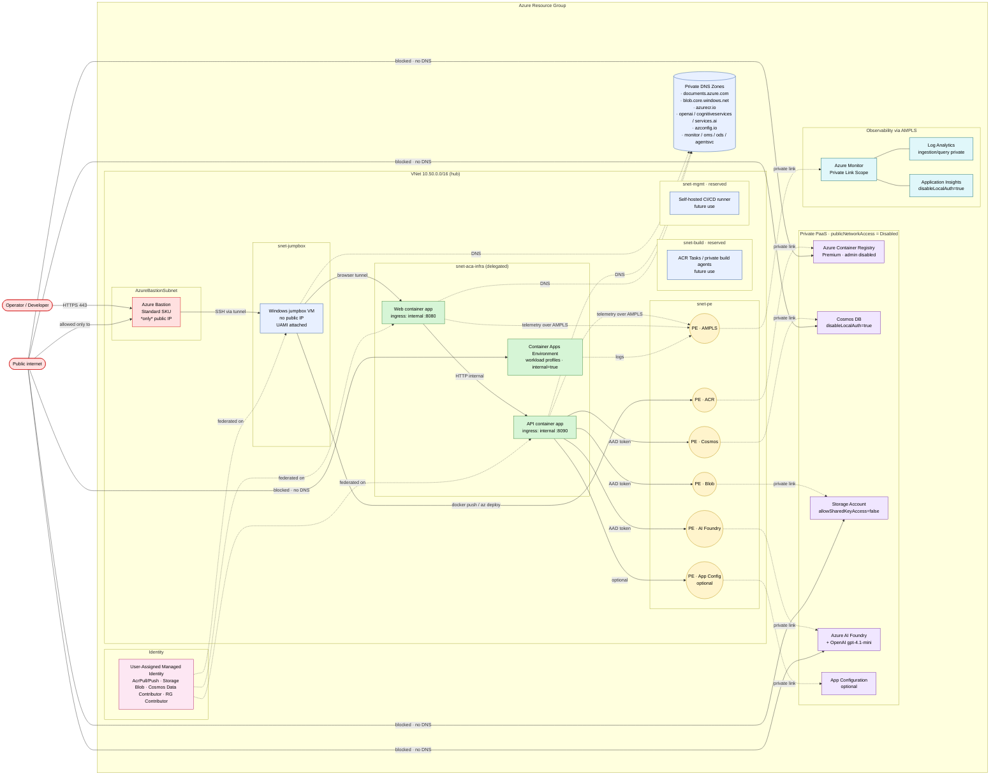
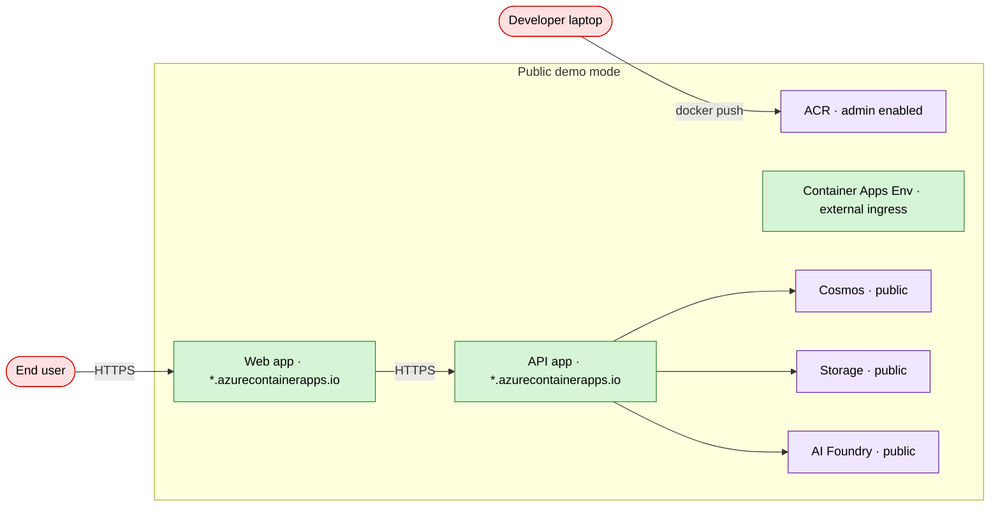

# Zero-Trust Architecture

End-to-end view of the Agentic AI Investment Analysis sample deployed with `isPrivate=true`. Every PaaS data plane is reached through a Private Endpoint inside a customer-owned VNet; there is no public DNS record for any workload. The only public surface is the Azure Bastion control-plane TLS endpoint used by operators.

## Logical view

## Request paths

### Operator deploy flow
1. Operator opens browser → **Azure Bastion** (HTTPS 443, Azure-hosted TLS).
2. Bastion proxies RDP to the **Windows jumpbox VM** inside `snet-jumpbox`.
3. Jumpbox uses its UAMI to:
   - `docker push` to the private **ACR** via PE (`privatelink.azurecr.io`).
   - `az deployment group create` for the API / Web container app bicep.
4. Container Apps control plane validates + schedules revisions; image pull happens over the ACR private link.

### Application runtime flow
1. Operator tunnels browser traffic through Bastion to the **Web app**'s internal FQDN (`*.<env-id>.<region>.azurecontainerapps.io`, resolved to the ACA env's static IP via the auto-linked private DNS zone).
2. Web app calls the **API app** over the internal ACA ingress.
3. API app requests an Entra ID token via the mounted UAMI (`AZURE_CLIENT_ID`) and calls:
   - **Cosmos DB** → PE `Sql` · zone `privatelink.documents.azure.com`
   - **Storage blob** → PE `blob` · zone `privatelink.blob.<storage-suffix>`
   - **Azure OpenAI / AI Foundry** → PE `account` · zones `openai`, `cognitiveservices`, `services.ai`
4. Telemetry emits to App Insights / Log Analytics through the **AMPLS** private endpoint (`privatelink.monitor.azure.com` + `oms` + `ods` + `agentsvc`).

## Subnet layout

| Subnet | CIDR | Purpose |
|---|---|---|
| `snet-aca-infra` | /23 | Delegated to `Microsoft.App/environments` — ACA internal VNet integration |
| `snet-pe` | /26 | All Private Endpoints (ACR, Cosmos, Blob, AI Foundry, AMPLS, App Config) |
| `snet-jumpbox` | /27 | Jumpbox NIC (no public IP) |
| `AzureBastionSubnet` | /26 | Required name for Azure Bastion |
| `snet-build` | /27 | Reserved for ACR Tasks / private build agents |
| `snet-mgmt` | /27 | Reserved for self-hosted CI/CD runners |

## Zero-trust controls checklist

| Control | Enforced at |
|---|---|
| No public data-plane access | `publicNetworkAccess=Disabled` on Cosmos, Storage, ACR, AI Foundry, Log Analytics, App Insights, App Config |
| No shared-key / local auth | `allowSharedKeyAccess=false` (Storage), `disableLocalAuthentication=true` (Cosmos), `adminUserEnabled=false` (ACR), `disableLocalAuth=true` (LA, AppI, AI Foundry, App Config) |
| Managed-identity-only workload auth | UAMI with scoped AcrPull/Push, Storage Blob Data Contributor, Cosmos Data Contributor, Azure AI User, RG Contributor (jumpbox) |
| Internal app ingress | ACA env `internal=true`, both container apps `ingressExternal=false` |
| Restricted CORS | `ALLOW_ORIGINS` env-driven (no `*` in private mode) |
| Private DNS | All PaaS resolution via customer zones linked to the VNet |
| Telemetry isolation | App Insights + Log Analytics scoped to an AMPLS with `PrivateOnly` ingestion + query |
| NSGs | Per-subnet deny-by-default with explicit Bastion + PE 443 allow rules |
| Single public surface | Azure Bastion Standard — one public IP for operator access only |

## Dual-mode (`isPrivate` flag)

The same bicep can also deploy the original public demo topology by passing `isPrivate=false` to [`main.bicep`](../infra/bicep/main.bicep):

In this mode there is no VNet, no private endpoints, no jumpbox, and no AMPLS — useful for quick demos but not for production.
