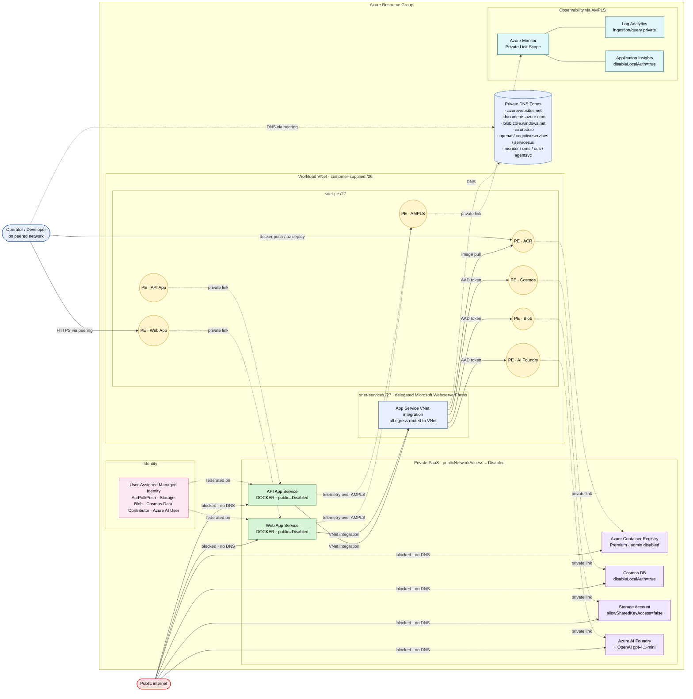

# Zero-Trust Architecture

End-to-end view of the Agentic AI Investment Analysis sample deployed with `isPrivate=true`. Every PaaS data plane is reached through a Private Endpoint inside a customer-owned VNet; there is no public DNS record for any workload. There is **no public ingress on the workload** — operators connect from the customer's own peered network (ExpressRoute, VPN, or hub VNet).

## Logical view

See the rendered diagram in [zero-trust-architecture.mmd](zero-trust-architecture.mmd). Inline source:

## Request paths

### Operator deploy flow
1. Operator workstation sits on a network that is **peered to the workload VNet** (ExpressRoute, site-to-site VPN, or hub VNet). DNS for `*.privatelink.azurecr.io`, `*.privatelink.azurewebsites.net`, etc. resolves to the workload's private endpoints via the linked private DNS zones.
2. From the workstation:
   - `docker push` to the private **ACR** via PE (`privatelink.azurecr.io`), **or** `az acr build` (ACR Tasks).
   - `az deployment group create` for the API / Web app Bicep templates.
3. App Service control plane validates + deploys; image pull happens over the ACR private link from the App Service VNet integration subnet.

### Application runtime flow
1. Caller (peered network) reaches the **Web app**'s private FQDN (`<name>.azurewebsites.net`) which resolves to the inbound private endpoint in `snet-pe`.
2. Web app calls the **API app** via its private endpoint over the VNet.
3. API app requests an Entra ID token via the mounted UAMI (`AZURE_CLIENT_ID`) and calls:
   - **Cosmos DB** → PE `Sql` · zone `privatelink.documents.azure.com`
   - **Storage blob** → PE `blob` · zone `privatelink.blob.<storage-suffix>`
   - **Azure OpenAI / AI Foundry** → PE `account` · zones `openai`, `cognitiveservices`, `services.ai`
4. Telemetry emits to App Insights / Log Analytics through the **AMPLS** private endpoint (`privatelink.monitor.azure.com` + `oms` + `ods` + `agentsvc`).

## Subnet layout

The customer supplies a single **/26** (64 IPs) for the workload VNet. It is split into two equal /27 subnets via `cidrSubnet()`:

| Subnet          | CIDR            | Purpose                                                                                                                                |
| --------------- | --------------- | -------------------------------------------------------------------------------------------------------------------------------------- |
| `snet-services` | /27 (offset 0)  | Delegated to `Microsoft.Web/serverFarms` — App Service VNet integration; `Microsoft.CognitiveServices` service endpoint for AI Foundry |
| `snet-pe`       | /27 (offset 32) | All Private Endpoints — App Service inbound, ACR, Cosmos, Blob, AI Foundry, AMPLS                                                      |

> Sizing note: /27 yields ~27 usable IPs per subnet. The App Service VNet integration subnet needs roughly 2× the worst-case instance count. If autoscale beyond ~10 instances per plan is expected, request a larger CIDR from the customer.

## Zero-trust controls checklist

| Control                             | Enforced at                                                                                                                                                        |
| ----------------------------------- | ------------------------------------------------------------------------------------------------------------------------------------------------------------------ |
| No public data-plane access         | `publicNetworkAccess=Disabled` on App Service apps, Cosmos, Storage, ACR, AI Foundry, Log Analytics, App Insights                                                  |
| No shared-key / local auth          | `allowSharedKeyAccess=false` (Storage), `disableLocalAuthentication=true` (Cosmos), `adminUserEnabled=false` (ACR), `disableLocalAuth=true` (LA, AppI, AI Foundry) |
| Managed-identity-only workload auth | UAMI with scoped AcrPull/Push, Storage Blob Data Contributor, Cosmos Data Contributor, Azure AI User                                                               |
| Private app ingress                 | App Service `publicNetworkAccess=Disabled`; reachable only via private endpoints in `snet-pe`                                                                      |
| Restricted CORS                     | `ALLOW_ORIGINS` env-driven (no `*` in private mode)                                                                                                                |
| Private DNS                         | All PaaS resolution via customer zones linked to the VNet                                                                                                          |
| Telemetry isolation                 | App Insights + Log Analytics scoped to an AMPLS with `PrivateOnly` ingestion + query                                                                               |
| NSGs                                | `snet-pe` permits inbound 443 from VirtualNetwork only; `snet-services` permissive within VNet for App Service integration                                         |
| No public surface                   | No Bastion, no jumpbox, no public IPs — operator access requires customer peering                                                                                  |

## Dual-mode (`isPrivate` flag)

The same Bicep can also deploy the original public demo topology by passing `isPrivate=false` to [`main.bicep`](../infra/bicep/main.bicep) (a placeholder `vnetAddressPrefix` like `10.0.0.0/26` is still required by the parameter signature but is unused). In this mode there is no VNet, no private endpoints, and no AMPLS — useful for quick demos but not for production.
